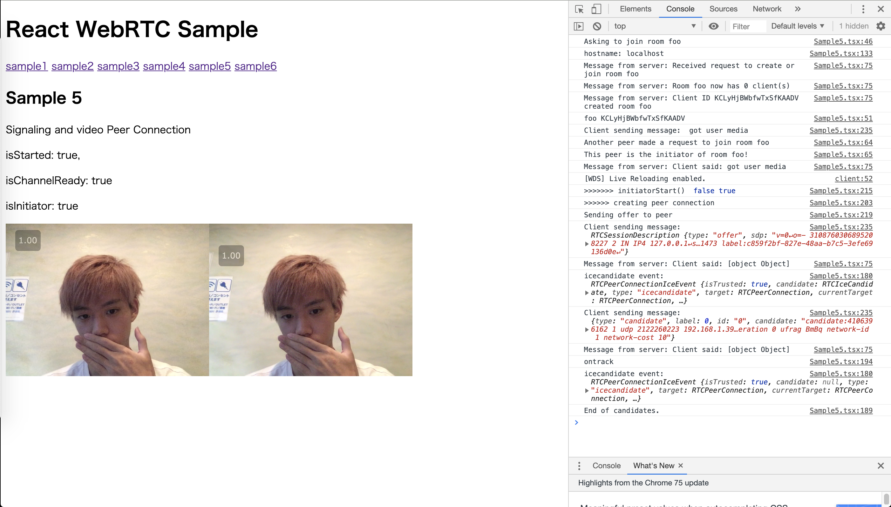

# react-webrtc-sample



# これは何
WebRTCを使ってビデオ通話/データ通信をするサンプルコードです。
[webrtc.org](https://webrtc.org) が出している [codelab](https://codelabs.developers.google.com/codelabs/webrtc-web/#0) のチュートリアルを参考に、React で作り直しました。

codelab のチュートリアルと同じく、以下のようなサンプルコードがあります。
- Sample1: 単純にカメラ映像を画面に移す
- Sample2: カメラ映像をもとに、1つのブラウザタブで1人2役で映像の送受信を行い表示する。
- Sample3: テキストデータを送信する(これも1人2役)
- Sample4: シグナリングサーバの登場。WebSocket を使いサーバと通信し、部屋IDを指定すると部屋に入る。
- Sample5: シグナリングサーバを利用して、P2Pのビデオ通話。 (ローカルでやるので2つタブを立ち上げて動かす)
- Sample6: シグナリングサーバを利用して、カメラ映像から画像を切り出し、相手に送信するサンプル。

上記チュートリアルのコードとの違い
- 素朴なJavaScript環境から Webpack, React, TypeScript にした。
- var が使われている ES5 からES2017 に
- 古い RTCPeerConnection.addStream() を使っている箇所を RTCPeerConnection.addTrack() に変更
- 1から6 までのサンプルコードをひとまとめにし、１回のビルドで見えるようにした。
  - React Router を使って1ページごとに1サンプルを置いてページ遷移をしている
  - それに伴いページの切り替わり時に RTCPeerConnection のclose 処理などを行い、状態がリセットされるようにしている。
- console.log() を見やすいように調整した
- その他諸々、リファクタリング。

# 必要なもの
Chrome75 で動くことは確認しましたが、Firefox がダメでした(Sample6のデータ送信)。他は知りません。

# SETUP

このリポジトリをcloneしてから

```console
cd react-webrtc-sample
yarn install
```

# RUN

```console
yarn start  # webpack-dev-server を起動
yarn start:server  # Sample4 以降を動かすのに必要なシグナリングサーバを起動
```

# 気に入ったら
スターよろしくおねがいします。
